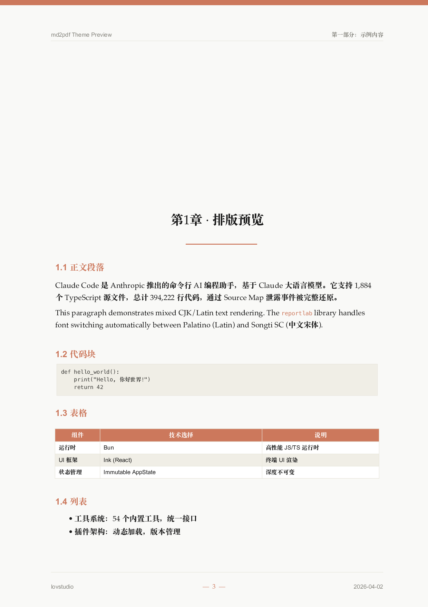
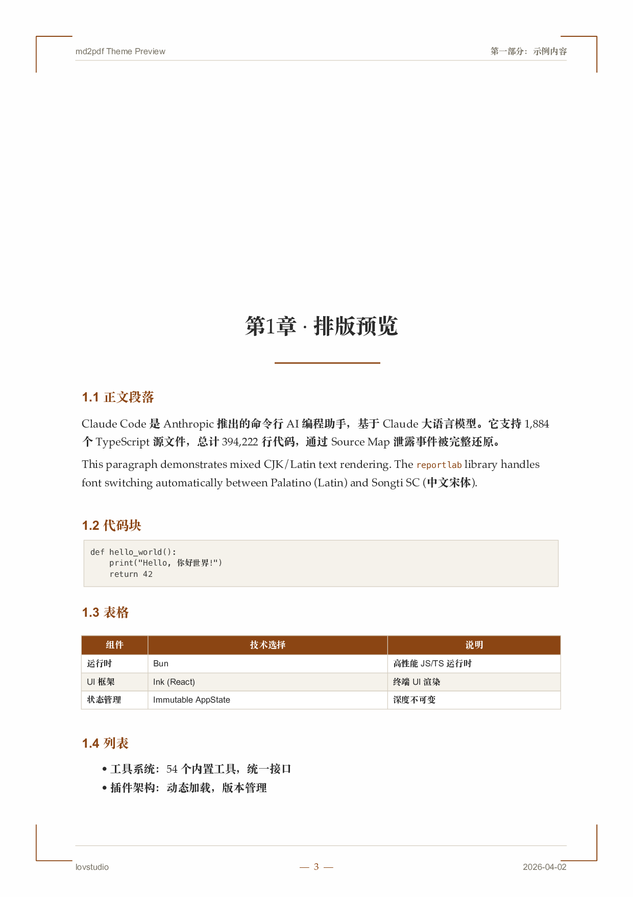
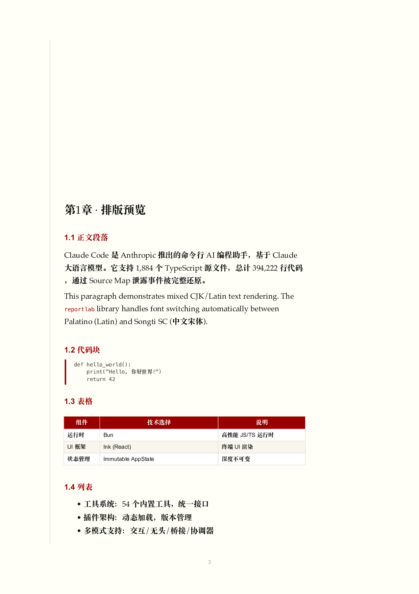
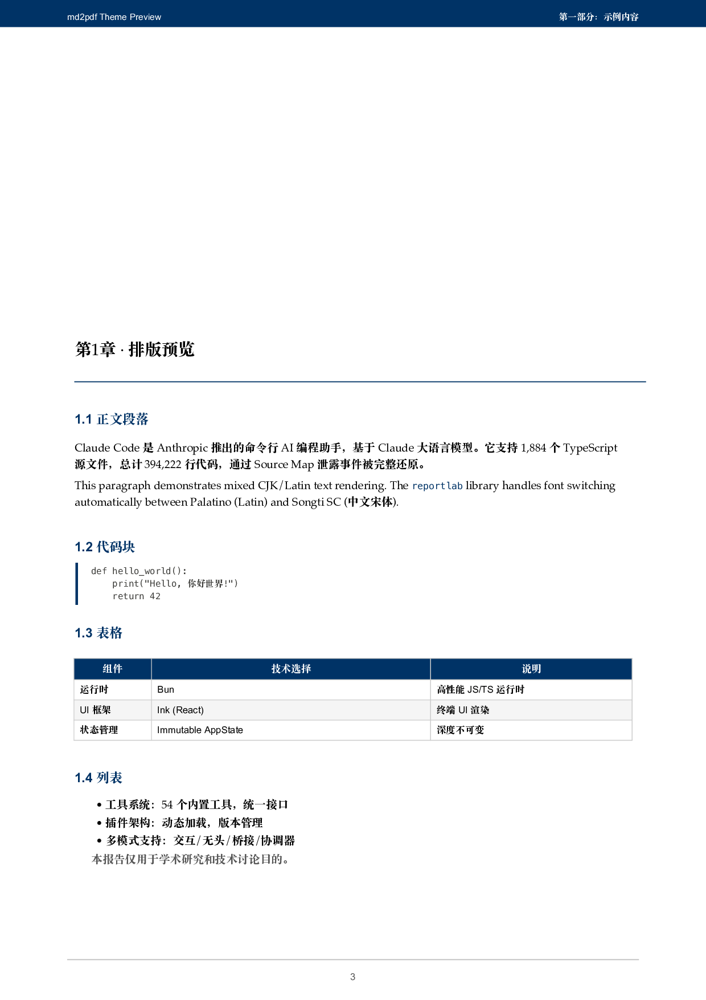
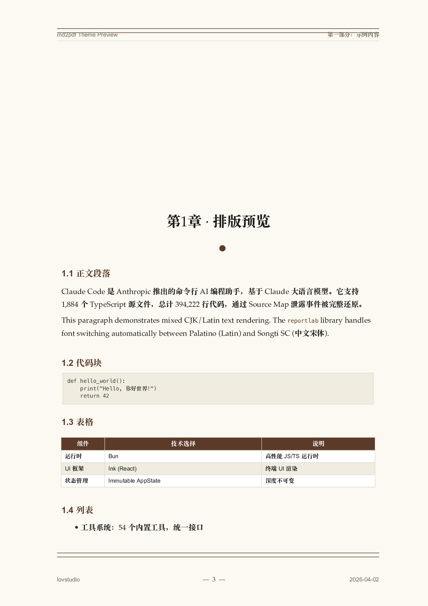
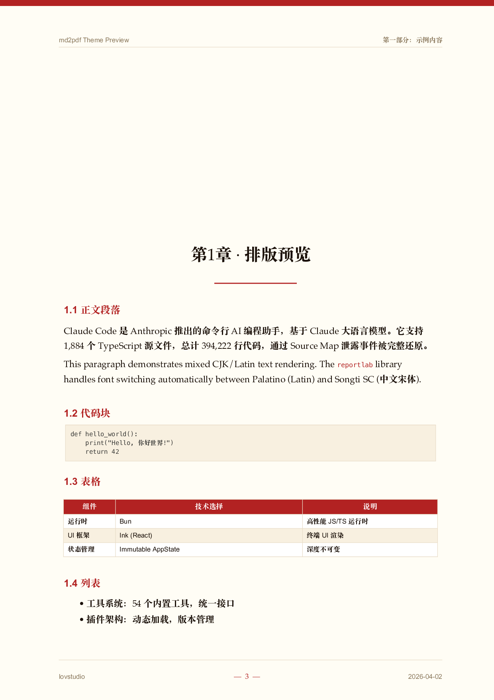
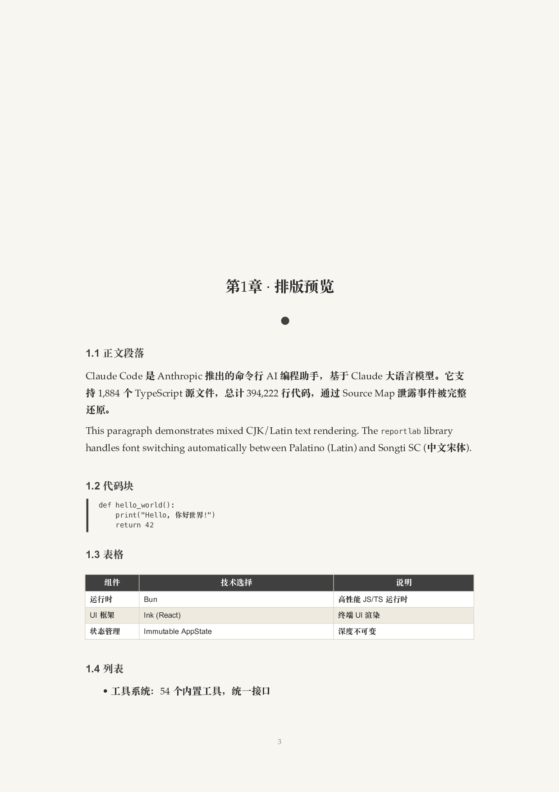
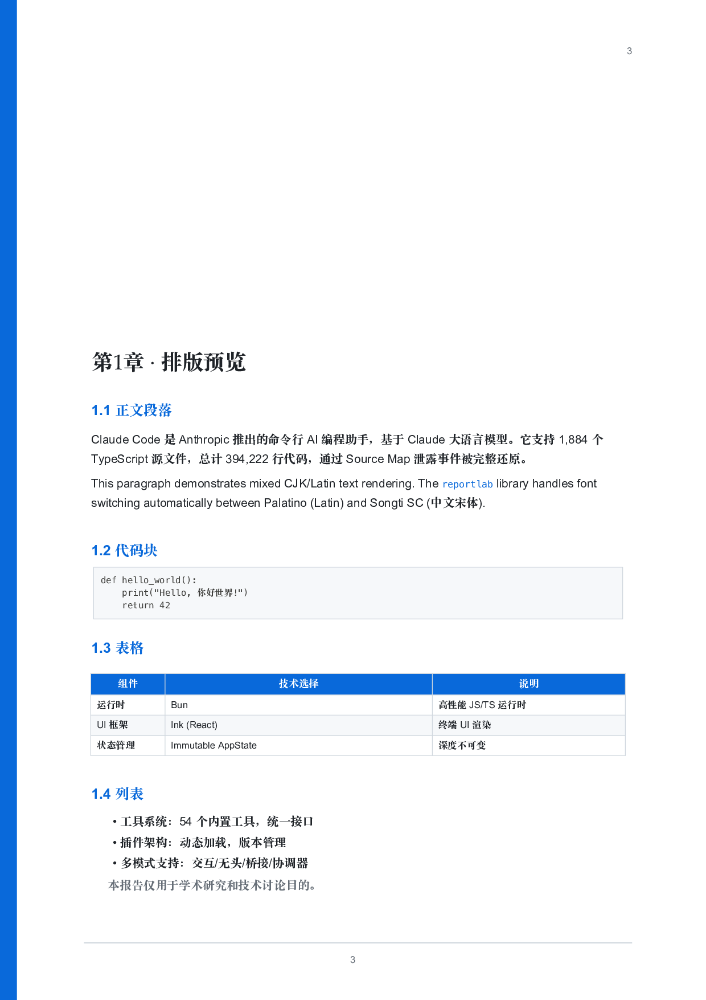
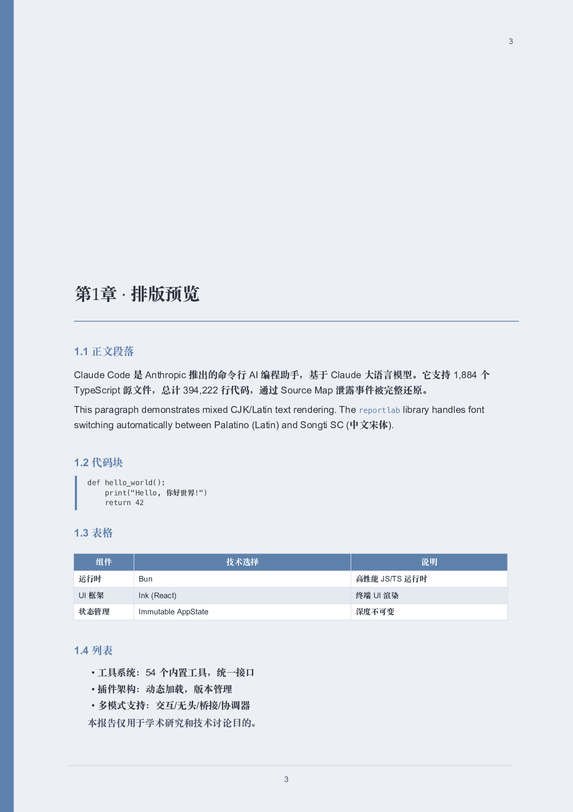
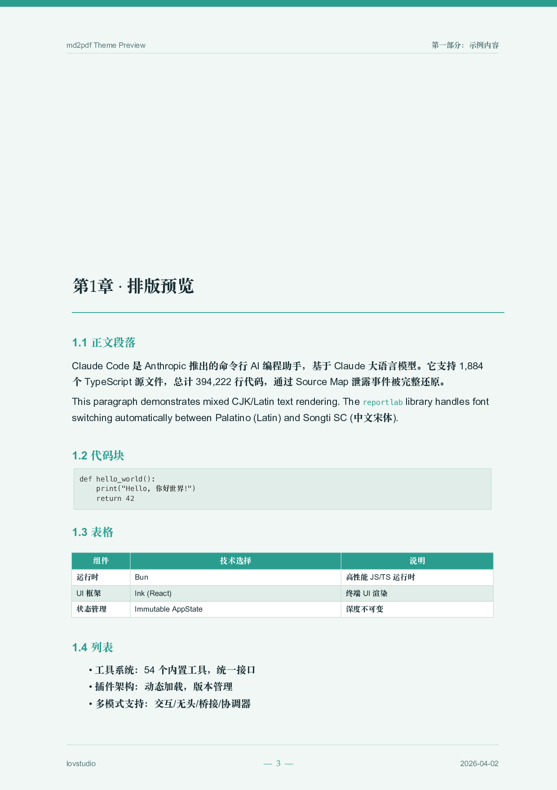

# md2pdf

**Tell your AI assistant "转PDF" and get a publication-quality document.** No config, no templates, no LaTeX.

An [agent skill](https://agentskills.io) that gives AI coding assistants (Claude Code, Cursor, Copilot, Gemini CLI, etc.) the ability to convert Markdown into professionally typeset PDFs — with a single natural language request.

## Why This Exists

Every existing Markdown-to-PDF tool falls into one of two traps:

1. **Too simple** — Pandoc/wkhtmltopdf produce passable output for English, but CJK mixed text gets butchered: wrong fonts, broken line wraps, "Claude Code" split across lines, 年月日 rendered as □□□.

2. **Too complex** — LaTeX produces beautiful output but requires a 4GB TeX distribution, arcane syntax, and breaks on every CJK edge case. No AI assistant can reliably drive it.

**md2pdf** is the sweet spot: one Python file, one dependency (`reportlab`), zero config — and it handles every CJK/Latin edge case because we hit them all building real 200-page Chinese technical reports.

## What Makes It Different

### For AI Agents — Zero-Friction Workflow

The skill teaches your AI assistant an **interactive workflow**, not just a CLI command:

```
You: "把这个报告转成PDF"

Agent: asks about design style, frontispiece, watermark, back cover
Agent: runs the conversion with all your choices
```

One sentence from you → a complete, branded document.

### For CJK Users — Battle-Tested on Real Reports

Every fix in this codebase came from a real rendering bug in a real report:

- **Mixed text wrapping**: "Chaofan Shou" won't split across lines; Chinese text breaks naturally at character boundaries
- **Canvas CJK**: Dates like "2026年4月1日" render correctly everywhere — cover, headers, footers
- **Book-quality fonts**: Palatino + 宋体 (macOS), Times + SimSun (Windows) — not Arial + fallback
- **Merged heading recovery**: Input like `# Part## Chapter` on one line? Auto-split before parsing

### For Everyone — Cross-Platform, Zero Config

| | macOS | Windows | Linux |
|---|---|---|---|
| Serif | Palatino | Times New Roman | Liberation/Noto Serif |
| CJK | Songti SC (宋体) | SimSun/微软雅黑 | Noto CJK |
| Mono | Menlo | Consolas | DejaVu Mono |
| Setup | `pip install reportlab` | `pip install reportlab` | `pip install reportlab` |

Fonts are auto-discovered from system paths. Missing fonts? You get a helpful error with the exact install command for your OS.

## Install

```bash
npx skills add lovstudio/md2pdf -g -y
```

Works with 25+ AI agents: Claude Code, Cursor, GitHub Copilot, Gemini CLI, Codex, Cline, Warp, and more.

## Design Styles

10 built-in themes — from classic LaTeX-inspired to modern minimalist. Click to preview.

<table>
<tr>
<td align="center" width="33%">
<strong>Warm Academic</strong><br>
<sub>陶土色调，温润典雅</sub><br>

</td>
<td align="center" width="33%">
<strong>Classic Thesis</strong><br>
<sub>LaTeX classicthesis 风格</sub><br>

</td>
<td align="center" width="33%">
<strong>Tufte</strong><br>
<sub>极简留白，深红点缀</sub><br>

</td>
</tr>
<tr>
<td align="center">
<strong>IEEE Journal</strong><br>
<sub>藏蓝严谨，期刊风格</sub><br>

</td>
<td align="center">
<strong>Elegant Book</strong><br>
<sub>LaTeX ElegantBook 风格</sub><br>

</td>
<td align="center">
<strong>Chinese Red</strong><br>
<sub>朱红配暖纸，中式正式</sub><br>

</td>
</tr>
<tr>
<td align="center">
<strong>Ink Wash</strong><br>
<sub>水墨风，纯灰黑素雅</sub><br>

</td>
<td align="center">
<strong>GitHub Light</strong><br>
<sub>蓝白极简，开发者风格</sub><br>

</td>
<td align="center">
<strong>Nord Frost</strong><br>
<sub>蓝灰北欧风，清爽现代</sub><br>

</td>
</tr>
<tr>
<td align="center">
<strong>Ocean Breeze</strong><br>
<sub>青绿色调，清新自然</sub><br>

</td>
<td align="center"></td>
<td align="center"></td>
</tr>
</table>

## What You Get

- **Cover page** with title, subtitle, author, version, stats lines
- **Clickable table of contents** with PDF bookmark sidebar
- **Frontispiece** — full-page image after cover (AI-generated or local)
- **Running headers** — report title + current chapter name
- **Running footers** — author/brand, page number, date
- **Watermark** — faint diagonal text on every content page
- **Back cover** — banner image or text branding (QR codes, business cards)
- **10 design themes** — from warm academic to ink wash minimalist

## Direct CLI Usage

```bash
pip install reportlab

python lovstudio-md2pdf/scripts/md2pdf.py \
  --input report.md \
  --output report.pdf \
  --title "My Report" \
  --author "Author Name" \
  --theme warm-academic \
  --watermark "DRAFT" \
  --toc true
```

See [SKILL.md](lovstudio-md2pdf/SKILL.md) for the full 20+ argument reference.

## License

MIT
